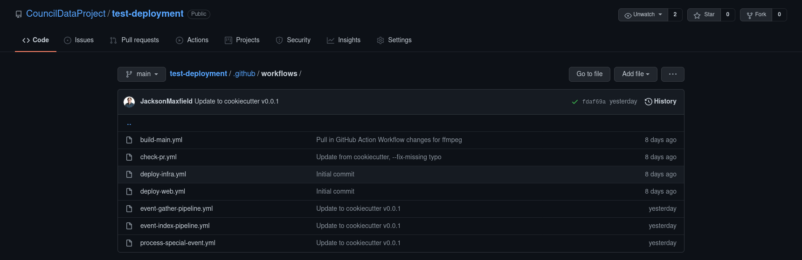

# Customizing Automated Pipelines

Council Data Pipelines all run for you automatically on set schedules
or on push to the repository and generally you should never need to change the
default configuration.

However, you may want to for example, change the interval, or the time that pipelines
run.

To do so, navigate to the `.github` directory of your repository
([GitHub link](https://github.com/CouncilDataProject/example/tree/main/.github)),
and then to the `workflows` sub-directory
([GitHub link](https://github.com/CouncilDataProject/example/tree/main/.github/workflows)).

All automated and manual workflows recide in this `.github/workflows` sub-directory.

The following sections will detail what is "safe" to edit.
If there isn't a section for the workflow you are wish to customize,
it is likely because we haven't thought of a reason for needing to customize the
pipeline. In general however, please refer to
[GitHub Actions Documentation](https://docs.github.com/en/actions) for more
information on how all of these workflows are constructed.

## Event Gather and Processing Pipeline

This pipeline ([including the manual trigger](./manual-event-gather.md))
can be found under `event-gather-pipeline.yml`
([GitHub link](https://github.com/CouncilDataProject/example/tree/main/.github/workflows/event-gather-pipeline.yml)).

The common reasons for customizing this pipeline are:

1. to change the automated schedule
2. to add required extra OS level dependencies (such as language and tool installations)

### Customizing Schedule

The pipeline schedule is handled by the
[GitHub Action CRON string](https://docs.github.com/en/actions/reference/events-that-trigger-workflows#scheduled-events).

You may want to change the CRON string to something that more closely matches the
time intervals when you know your municipality tends to post events.

Be careful, don't add too many intervals as if you try to scrape or request
from a resource too often, your pipeline may start to fail because you are
requesting _too_ often.

### Adding Extra OS Dependencies

The pipeline runs on an Ubuntu server and as such to install many OS level
dependencies you can use `apt` to install more packages. In general,
it is safe to add as many of these extra dependencies as you need and there is already
a section where we add dependencies like this to the pipeline.

See the "Install Packages" task of this workflow file and add any more
packages you may need there.

For more programming language support, look into
[GitHub's existing "setup x" actions](https://github.com/actions) and add them
to the pipeline just like the current "actions/setup-python" task.

## Event Indexing Pipeline

This pipeline can be found under `event-index-pipeline.md`
([GitHub link](https://github.com/CouncilDataProject/example/tree/main/.github/workflows/event-index-pipeline.yml)).

The common reasons for customizing this pipeline are:

1. to increase or decrease the frequency a new index is created

### Changing Indexing Frequency

This is controlled by the
[GitHub Action CRON string](https://docs.github.com/en/actions/reference/events-that-trigger-workflows#scheduled-events).

You may want to increase the frequency to generate a fresh index more often or decrease
the frequency because events only happen once a week (or less) and in doing so you can
reduce the cost of running the instance.

The more frequent the index pipeline runs and the more events that it is indexing,
the database cost increases simply due to how many times you are writing many thousands
of documents to the database per pipeline run.
